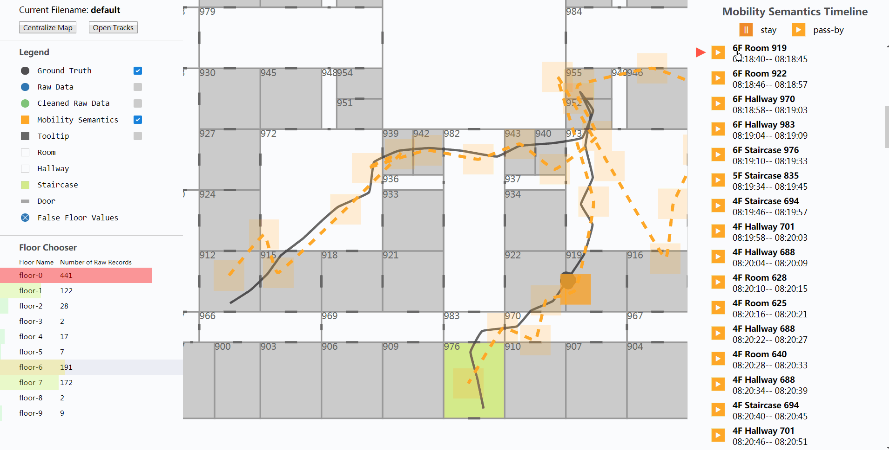

# Indoor Mobility Viewer

Indoor mobility viewer is an single-page html5 application that allows you to compare different kinds of tracks during different stages of location data processing. The viewer renders an indoor map in the middle of the webpage, and renders lines (represent tracks) and points (represent locations) on the map. As the legend part on the left shows, lines/points with different colors/shapes represents differents kinds of tracks or locations.

The user may switch floor using the *Floor Chooser*. The viewer provides a set of built-in floor data files, from F-0 to to F-9 (these files are the same except for the number of room). In the floor chooser, the viewer also renders a number indicating the number of raw records and a horizontal bar in the background which shows the *heat* for every floor.

In the top left, the viewer shows the name of current opened file and provides a button to open other track files. The checkboxes in legend part are used to toggle visibilities of lines or points.

The *Mobility Semantics Timeline* part is in the right of the web application. In our article, we have introduced several algorithms to generate semantic tracks. A semantic track is composed of an array of semantic points, with each point represents a *stay* or *pass-by* semantic event. Every semantic event has four properties: semantic type (stay or pass-by), time interval, floor number and room id. Semantic events are sorted by start time and displayed top to bottom.

When clicking a semantic event in the timeline part, the corresponding event is *selected*. The viewer will use a higher opacity for the semantic point on the map if the corresponding event is selected. Location points will appear if they are in the time range of the selected semantic event. Then the user could compare location points and evaluate the effect of the algorithm. Users could press `Page-Up` / `Page-Down` to navigate among semantic events. When navigating to an semantic point in other floor, the viewer will switch floor automatically.

Currently, except semantic tracks, there are three other kinds of tracks. *Ground truth tracks* are composed of groundtruth location points which are generated by our indoor positioning data simulator. *Raw data* tracks are composed of raw locations points which are exported from our WiFi access points. *Cleaned raw data* tracks are output of the clean-algorithm which fix the floor of raw points and remove outlier raw points.

## Features

* Display different tracks at the same time, and the appearances of points on different tracks are synchronized with the selected period. Easy to compare tracks and evaluate positioning accuracy and clustering algorithm performance.
* Toggle the visibilities of points/tracks in the legend, hide the noise and focus on the interesting part.
* Navigate between different time intervals by clicking the entries on the timeline; Press down/up key to select next/previous entry repeatedly and play the semantic story.
* Simple and intuitive user interactions; Auto zoom after switch to a semantic item in another floor.

## Former Version

This version is implemented by [Cycle.js](https://cycle.js.org). The former react version is [here](https://github.com/shinima/indoor-mobility-viewer).